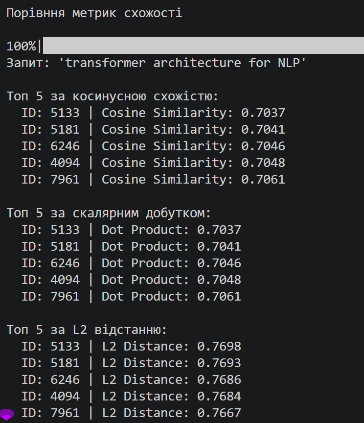

### **Preparation:**
1. Dataset address: https://www.kaggle.com/datasets/Cornell-University/arxiv
2. Download the json data:
```bash
mkdir -p ./data
curl -L -o ./data/arxiv.zip https://www.kaggle.com/api/v1/datasets/download/Cornell-University/arxiv
unzip ./data/arxiv.zip -d ./data
```
3.  Готуємо датасет: `uv run scripts/01_prepare_data.py`

---

### Part 2
**1.2. answers:**
1. Pinecone vs Qdrant vs Chroma

    a) За моделлю розгортання
    - **Pinecone** — переважно хмарний, повністю керований сервіс. Це найпростіший варіант для продакшену, бо не потребує адміністрації інфраструктури.
    - **Qdrant** — може працювати як self-hosted (Docker, Kubernetes) або у хмарній версії. Дає більше контролю над середовищем розгортання.
    - **Chroma** — найпростіший у запуску для локальної розробки або self-hosted використання. Часто обирають для прототипів та невеликих проєктів.

    b) За ліцензією
    - **Pinecone** — комерційний продукт з пропрієтарною ліцензією.
    - **Qdrant** — відкритий код, ліцензія Apache 2.0.
    - **Chroma** — відкритий код, ліцензія Apache 2.0.

    c) За продуктивністю
    - **Pinecone** — зазвичай найкраще підходить для великих production RAG-систем завдяки високій доступності, низькій затримці та простоті масштабування.
    - **Qdrant** — показує сильний баланс між продуктивністю, гнучкістю та контролем. Добре підходить для продакшену, якщо важливий self-hosting.
    - **Chroma** — добре працює для локальної розробки та середніх навантажень, але не завжди є найкращим вибором для дуже великих production сценаріїв.

    d) Коли обрати кожен
    - **Pinecone** — якщо потрібен швидкий, масштабований і простий у підтримці продакшен для RAG або векторного пошуку.
    - **Qdrant** — якщо хочете зберегти контроль над інфраструктурою, працювати з open-source стеком і мати гнучке розгортання.
    - **Chroma** — якщо потрібен простий старт для MVP, локальної розробки або невеликого проєкту.

    e) Короткий висновок
    - **Pinecone** — найпростіший продакшен-вибір.
    - **Qdrant** — найкращий компроміс між open-source, контролем і продуктивністю.
    - **Chroma** — найкращий для прототипів і локальної роботи.

2. Для задачі пошуку по наукових статтях було обрано модель `allenai/specter2_base`, а не універсальну `sentence-transformers/all-MiniLM-L6-v2`, оскільки вона спеціально створена для роботи з науковими текстами.

    З картки моделі на Hugging Face видно, що SPECTER2 призначена для генерації embeddingів для наукових задач. У описі моделі зазначено:

    > “SPECTER2 is capable of generating task specific embeddings for scientific tasks when paired with adapters. Given the combination of title and abstract of a scientific paper or a short textual query, the model can be used to generate effective embeddings to be used in downstream applications.”

    Крім того, у картці моделі вказано, що вона навчена для таких задач:
    - Classification
    - Regression
    - Proximity (Retrieval)
    - Adhoc Search

    Також модель навчалась на більш ніж 6 мільйонах triplets, що базуються на цитуваннях наукових статей, що робить її особливо придатною для пошуку схожих статей, рекомендацій та retrieval у науковій сфері.

    На відміну від цього, `sentence-transformers/all-MiniLM-L6-v2` є більш загальною sentence embedding-моделлю. Її картка описує її як модель для:
    - sentence and short paragraph encoding
    - sentence similarity
    - clustering
    - semantic search

    Тобто це хороший універсальний варіант для загальних текстових задач, але не спеціалізований під наукову доменну задачу.

    Джерела:
    - Hugging Face: https://huggingface.co/allenai/specter2_base
    - Hugging Face: https://huggingface.co/sentence-transformers/all-MiniLM-L6-v2

3. Про метрику схожості для `allenai/specter2_base`

    У картці моделі `allenai/specter2_base` прямо не вказано назву конкретної метрики схожості, наприклад cosine similarity або dot product. Проте в описі моделі явно зазначено, що вона призначена для задач:

    - Proximity (Retrieval)
    - Adhoc Search
    - Nearest Neighbor Search

    Це означає, що модель розроблена для пошуку близьких документів за векторами, а не лише для загального представлення тексту.

    Чому це важливо при створенні індексу:
    - при створенні векторного індексу необхідно використовувати ту ж саму метрику схожості, що й під час пошуку запиту;
    - якщо метрика зміниться, результати пошуку можуть стати менш точними;
    - релевантні документи будуть повертатися рідше, а якість retrieval знизиться.

    На практиці для embedding-based search зазвичай використовують cosine similarity, оскільки вона добре працює для семантичного пошуку і дає стабільні результати для векторів текстів.

---

**1.3. answers:**

При використанні нормалізованих ембеддингів (одиничної довжини) косинусна схожість (cosine similarity) еквівалентна скалярному добутку (dot product) тому, що це випливає з формули косинусної схожості:

cosine_similarity(a,b) = np.dot(a, b) / (np.linalg.norm(a) * np.linalg.norm(b)),

тобто коли вектори нормалізовані (їх довжина дорівнює 1), то у знаменнику значення 1, і тоді cosine_similarity(a,b) = np.dot(a, b) / (1 * 1) 

---

### Part 3
**3.4.3 Answers:**
1. Результати пошуку:
    - пошук статтей по reinforcement learning за останні 5 років в категорії cs.LG - видача = 0 результатів.
    - більш старі статті (до 2015 року), будь-яка категорія - у видачі більше 5-ти результатів.
    Пояснення: При формуванні дата-сету ми відібрали перші 10000 документів, тому у відбір попали документи виключно за 2007 рік.
 


**Answers:**
1. Для cosine і dot product ТОП-5 збігаються тому, що використовуються нормалізовні вектори. Як було доведено вище, при використанні нормалізованих векторів косинусна схожість (cosine similarity) еквівалентна скалярному добутку (dot product).
2. Для метрики L2 рейтинг ТОП-5 векторів збігається з cosine і dot product, але відрізняються самі значення метрики L2-similarity, тому що вони вимірюють різні геометричні властивості і працюють у різних масштабах, хоча для нормалізованих векторів вони математично ідеально корелюють.

3. Якби ембеддинги не були нормалізовані, то на результат пошуку впливали б не тільки кути між векторами (які характеризують семантичну схожість двої документів), а й їх довжина (наприклад, кількість слів у документі). Для завдання семантичного пошуку це зайва інформація, яка буде спотворювати результати (вектори з невеликим кутом, але різною нормою будуть оцінені як семантично різні, що є помилкою).

---

### Part 4
1. З двох стратегій формування чанків більш осмислені та логічно завершені чанки дає семантичний підхід, бо він аналізує зміст і ділить текст за логічними межами (речення, абзаци, зміна теми), на відміну від фіксовано розбиття, яке ділить текст за заданою кількістю символів або токенів (наприклад, по 500 токенів), часто з невеликим перекриттям (overlap) незалежно від завершенності змісту чанка.
2. При використанні фіксованого розбиття є випадки розрізаних речень - цей підхід працює "наосліп" і може розірвати речення, думку чи програмний код навпіл. На відміну від семантичного розбиття, яке зберігає контекст та цілісність ідеї в одному блоці.
3. Збільшення розміру перекриття (overlap) збільшує загальну кількість чанків і покращує контекстне покриття (збереження сенсу) на стиках блоків тексту. Проте це завжди компроміс між втратою контексту та витратами на обробку даних:
Розмір Overlap	та вплив на покриття і пошук:
    - Overlap = 0% (Без перекриття):	Високий ризик "сліпих зон". Якщо ключова ідея чи речення розрізані навпіл (кінець першого чанка і початок другого), пошуковий рушій може не знайти жоден з них, оскільки порізно вони не мають достатнього семантичного сенсу.
    - Overlap = 10-20% (Оптимальний):	Золота середина. Достатньо, щоб "зшити" контекст. Речення, яке почалося в одному чанку, повністю завершиться в наступному. Сенс зберігається, а дублювання інформації мінімальне.
    - Overlap = 50% (Надмірний):	Контекст збережено ідеально, але пошук страждає через "розмиття". Векторна база даних може повернути 3-4 майже однакові чанки як найрелевантніші результати, витісняючи інші важливі фрагменти тексту з контексту (context window), який передається мовній моделі.

---

### Part 5
**Answers:**
1. Найкращий метод - гібридний, бо він використовує переваги обох методів -як прямий пошук по словах, так і за семантичною близкістю.
2. Так, і це основна фіча та перевага гібридного пошуку. RRF працює за принципом пошуку консенсусу. Метод віддає перевагу документам, які отримали стабільно високі (або середньо-високі) оцінки в усіх джерелах, порівняно з тими, які були №1 в одному джерелі, але повністю провалилися в іншому.
3. Константа _k_ у формулі Reciprocal Rank Fusion (RRF) відіграє роль балансира. Вона визначає, наскільки сильно ми «штрафуємо» документ за те, що він знаходиться нижче у списку результатів.
    - Якщо _k_ дуже мале (1-10), знаменник дробу зростає повільно, але відносна різниця між першими місцями стає величезною.Ефект: Система неймовірно високо цінує 1-ше та 2-ге місця з будь-якого джерела. Документ, який є №1 хоча б у векторному пошуку, отримає такий великий бал, що легко обійде документ, який посів 3-тє місце в обох списках.Коли відбувається: Крива падіння ваги дуже стрімка. Топ-результати домінують.
    - Коли _k_ велике (100-1000), різниця між 100+1 та 100+10 стає математично незначною.Ефект: Вага позиції майже нівелюється. На перший план виходить присутність документа в обох списках. Якщо документ потрапив і в топ BM25, і в топ векторної видачі (навіть на 20-ті місця), його сумарний бал буде вищим, ніж у документа, який посів 1-ше місце лише в одному списку.Коли відбувається: Крива падіння стає пласкою. Перемагає консенсус.

---

### Part 6
**Answers:**
1. Запити та переможці:
    - запит 'BERT fine-tuning' - виграв метод BM25 в порівнянні з векторним пошуком зі статтею "The NMSSM Solution to the Fine-Tuning Problem, Precision Electroweak",
    - запит 'making computers understand human emotions from text' - виграв векторний пошук в порівнянні з методом BM25 зі статтею "On the Development of Text Input Method".
    - запит 'Yann LeCun convolutional networks' - виграв гібридний метод зі статтею "Multi-Dimensional Recurrent Neural Networks", інші методи дали результати, які потрапили у TOP-5, але не на перше місце.

    Загальне правило: якщо треба знайти точний збіг за ім'ям, артикулом, назвою - то краще працює B25, а якщо треба знайти документи, де можуть зустрічатися сининіми або схожі ідеї/змісти - то векторний пошук краще виконає завдання.
2. Якщо чанк занадто маленький (10–15 слів) - такі розміри (приблизно одне коротке речення або частина речення) створюють вузькоспрямовані вектори, але зазвичай призводять до втрати сенсу. Малі чанки часто розривають зв'язки між займенниками ("він", "це", "вони") та їхніми іменниками, що знищує семантичний зв'язок між частинами контексту. Також це зменшує спроможність до синтезу - якщо відповідь на запитання розкидана на кілька речень, дрібні чанки можуть не потрапити у топ результатів пошуку одночасно.
Якщо чанк занадто великий (500+ слів), то це приводить до семантичного розмиття, коли декілька тем в чанку усереднюють вектор до втрати специфіки інформації. Дослідження показують, що сучасні LLM добре звертають увагу на початок і кінець довгого тексту, але часто ігнорують факти, заховані всередині великих блоків (проблема "уваги" моделі). Тобто великі чанки збільшують шум у контексті - моделі передається 90% непотрібної інформації разом із 10% корисної, що збільшує ризик галюцинацій та підвищує вартість запиту, якщо мова йде про RAG.
Оптимальний розмір залежимть від задачі: фактологічні запити - малі чанки, резюмування, аналіз концепцій - великі чанки, оптимальні (250-500 токенів) - більшість завдань пошуку.
3. Система працюватиме коректно і знайде правильних найближчих сусідів. Єдина різниця полягатиме у значеннях оцінок (scores), які поверне Pinecone. Враховуючи математичний зв'язок L2​(a,b)=2−2⋅cosine(a,b) видно, що чим більша косинусна подібність (чим ближче вона до 1), тим менша Евклідова відстань (тим ближче вона до 0). Мінімізація L2-відстані математично еквівалентна максимізації косинусної подібності. Саме тому Pinecone поверне ті самі Top-K результатів у тому самому порядку. Але якщо б модель повертала ненормалізовані вектори, то метрики починають вимірювати різні геометричні властивості векторів, і монотонний зв'язок між ними зникає, та результати ранжування були б зовсім іншими.
4. Безкоштовний тариф Pinecone Starter (serverless-версія) має такі ліміти та обмеження:
    - Обмеження до 2 ГБ дискового простору. Для наших векторів розмірністю 768 з базовими метаданими це дозволяє зберегти близько 600 тисяч записів;
    - Тариф обмежується 2 мільйонами одиниць запису (Write Units) та 1 мільйоном одиниць читання (Read Units) на місяць. Масове завантаження даних може швидко вичерпати квоту запису;
    - Дозволено створити не більше 5 індексів у межах 1 проекту, що може бути обмеженням для великого проекту зі складною структурою даних.

    Для роботи з датасетом на 10М статей я б:
    - розгортав базу на Milvus, Qdrant або pgvector на власних серверах (VM/AWS/GCP);
    - використовував алгоритми квартизації, наприклад, таких як Product Quantization (PQ) або Scalar Quantization (SQ) (перехід на int8 або binary), бо тримати 100 мільйонів векторів у оперативній пам'яті у форматі float32 (32-бітні числа з плаваючою комою) надзвичайно дорого. Це зменшить споживання оперативної пам'яті у 4–10 разів при мінімальній втраті точності пошуку (1-3%) за деякими даними;
    - використовував інші методи індексації, більш релевантні до великого обсягу статей, щоб граф спочатку кластеризував дані, що дозволяє шукати лише у відповідному кластері, а не по всій 10-мільйонній базі - наприклад, IVF-PQ (Inverted File with Product Quantization) або оптимізовані версії HNSW;
    - я би використовував гібридний пошук, бо на обсягах у 10 мільйонів статей суто семантичний (векторний) пошук почне видавати забагато "шуму", знаходячи тексти зі схожим сенсом, але без ключових деталей.
